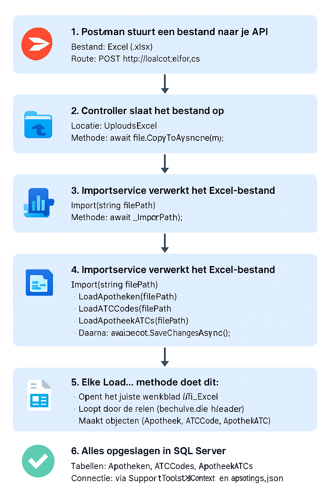

1. **Postman stuurt een bestand naar je API**  
   - **Bestand**: Excel (.xlsx)  
   - **Route**: `POST http://localhost:5227/api/import/upload`  
   - **Controller**: `ImportController.cs`  
   - **Methode**: `UploadExcel(IFormFile file)`

📥 **2. Controller slaat het bestand op**  
   - **Locatie**: `Uploads/Testdata.xlsx`  
   - **Methode**: `UploadExcel`  
   - **Actie**: `await file.CopyToAsync(stream);`

📦 **3. Controller roept de importservice aan**  
   - **Service**: `ExcelImportService.cs`  
   - **Methode**: `await _importer.Import(filePath);`

📊 **4. Importservice verwerkt het Excel-bestand**  
   🔹 `Import(string filePath)` roept drie methoden aan:  
   - `LoadApotheken(filePath)`  
   - `LoadATCCodes(filePath)`  
   - `LoadApotheekATCs(filePath)`  
   - Daarna: `await _dbContext.SaveChangesAsync();`

📄 **5. Elke `Load...` methode doet dit:**  
   - Opent het juiste werkblad in Excel  
   - Loopt door de rijen (behalve de header)  
   - Maakt objecten (`Apotheek`, `ATCCode`, `ApotheekATC`)  
   - Voegt ze toe aan de database via `_dbContext`

✅ **6. Alles opgeslagen in SQL Server**  
   - **Tabellen**: `Apotheken`, `ATCCodes`, `ApotheekATCs`  
   - **Connectie**: via `SupportToolsDbContext.cs` en `appsettings.json`

